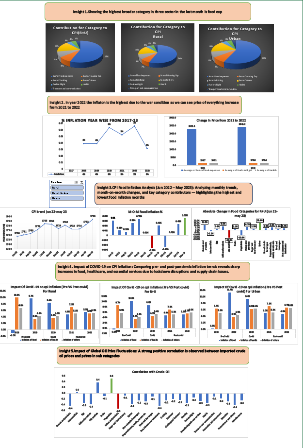

# 📊 CPI Inflation Analysis

## 📌 Project Overview

This project analyzes **Consumer Price Index (CPI)** data from **January 2013 to May 2023** to understand inflation trends and the key factors influencing price movements.

The analysis focuses on identifying long-term inflation patterns, understanding category-level contributions, evaluating the impact of the **COVID-19 pandemic**, and exploring the relationship between **crude oil prices and CPI categories**.

---

## 📊 Dashboard

### Dashboard Highlights

The dashboard provides an interactive view of:

- 📈 Overall CPI and inflation trends
- 🛒 Category-wise CPI performance
- 🦠 COVID-19 impact on inflation
- 🛢️ Crude oil price trends
- 🔗 Relationship between crude oil prices and CPI categories
- 📊 Key inflation indicators and trends

---

## 🎯 Objectives

The key objectives of this analysis are:

- Analyze the overall trend in CPI and inflation over time.
- Identify periods of significant inflationary changes.
- Determine which CPI categories contributed most to inflation.
- Analyze the impact of COVID-19 on consumer prices.
- Examine the relationship between crude oil prices and CPI categories.
- Identify important trends and patterns from the data.
- Generate insights that can help explain changes in consumer prices.

---

## 🗂️ Dataset

**Time Period:** January 2013 – May 2023

The dataset contains CPI-related information across different categories and time periods, along with crude oil price data used to investigate potential relationships between energy prices and consumer inflation.

### Key Variables

- Date
- CPI
- Inflation Rate
- CPI Categories
- Category-wise CPI values
- Crude Oil Prices

---

## 🔍 Analysis Performed

### 1. 📈 Inflation Trend Analysis

- Overall inflation patterns
- Periods of rapid price increases
- Changes in inflation over time
- Major peaks and fluctuations

### 2. 🛒 Category-Level Analysis

- Category-wise price movements
- Major contributors to CPI
- Categories with the highest price increases
- Major drivers of CPI movements

### 3. 🦠 COVID-19 Impact Analysis

- Pre-COVID vs COVID inflation trends
- Categories most affected by the pandemic
- Price fluctuations during the disruption
- Post-pandemic inflation trends

### 4. 🛢️ Crude Oil & CPI Relationship

Investigated the relationship between crude oil prices and CPI categories to understand whether changes in energy prices were associated with movements in consumer prices.

---

## 💡 Business / Economic Takeaways

This analysis demonstrates how historical CPI data can be used to:

- Monitor inflationary pressures
- Identify major contributors to price increases
- Understand the impact of external economic events
- Analyze relationships between commodity prices and consumer prices
- Support data-driven economic decision-making

---

## ❓ Business Questions

- How has inflation changed from 2013 to 2023?
- Which CPI categories are the biggest contributors to inflation?
- How did COVID-19 affect consumer prices?
- Is there a relationship between crude oil prices and CPI?
- Which categories are most sensitive to changes in crude oil prices?

---

## 🛠️ Tools Used

- **Microsoft Excel**
- Data Cleaning
- Pivot Tables
- Data Analysis
- Data Visualization
- Dashboard Development

---

## 👨‍💻 Author

**Paras Sahu**

Data Analyst | SQL | Python | Excel | Power BI
